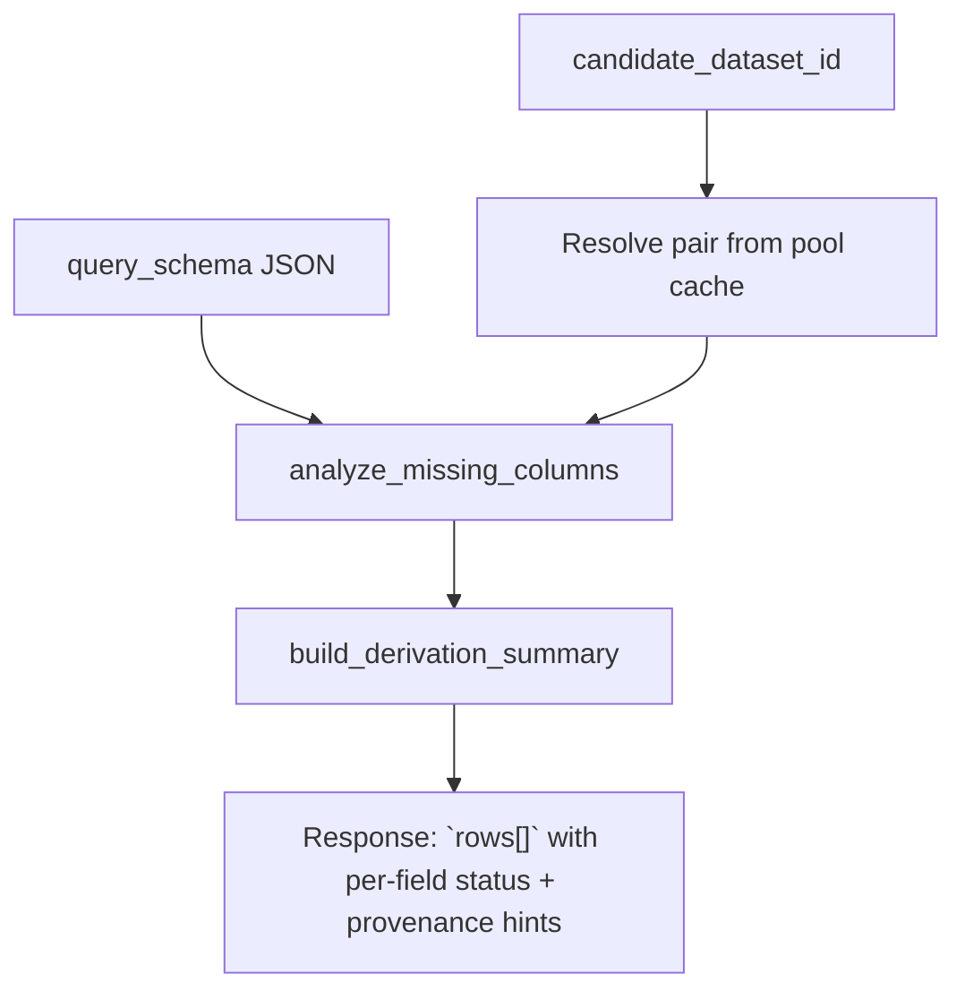

# PATRA Agent Tools — Architecture & Data Flow (English)

This document describes the **current** HTTP surface and backend modules for **paper → schema search** and **deterministic derived data** (missing-column feasibility and optional CSV synthesis).

---

## 1. Component overview

```mermaid
flowchart TB
  subgraph Client["Client (Web UI / API consumer)"]
    UI[Agent Tools view]
  end

  subgraph API["FastAPI — `/agent-tools/*`"]
    R1["`GET /schema-pool`"]
    R2["`POST /paper-schema-search`"]
    R3["`POST /missing-column-analysis`"]
    R4["`POST /generate-synthesized-dataset`"]
    R5["`GET /generated-artifacts/{key}` + downloads"]
  end

  subgraph Svc["`patra_agent_service`"]
    EX[extract_schema]
    MM[_build_matcher + match]
    CR[_candidate_rows]
    MC[analyze_missing_columns_for_candidate]
  end

  subgraph Synth["`patra_synthesis_service`"]
    GEN[generate_synthesized_dataset]
  end

  subgraph Lib["Repo `src/`"]
    PSP[paper_schema_parser]
    HSM[hybrid_schema_matcher]
    MCD[missing_column_derivation]
    POOL[patra_schema_pool — public schema pool]
  end

  subgraph Store["Persistence & cache"]
    PG[(PostgreSQL — `generated_dataset_artifacts`)]
    CACHE["`.patra-agent-cache/` — pool CSVs, downloads, generated CSV/JSON"]
  end

  UI --> R1 & R2 & R3 & R4 & R5
  R1 --> POOL
  R2 --> EX --> PSP
  EX --> MM --> HSM
  MM --> CR --> MCD
  R3 --> MC --> MCD
  R4 --> GEN --> MCD
  GEN --> CACHE
  R4 --> PG
  POOL --> CACHE
  HSM -. optional LLM rerank .-> HSM
```

---

## 2. Paper schema search (`POST /paper-schema-search`)

**Input:** exactly one of `document_path`, `document_url`, or `document_text` (plus optional `document_format`, `top_k`, `disable_llm`, LLM endpoint settings, `cache_dir`).

```mermaid
flowchart LR
  subgraph In["Document input"]
    P[path]
    U[url]
    T[text]
  end

  subgraph Parse["Schema extraction"]
    DOCX["DOCX / MD / JSON → `extract_schema_from_document`"]
    HTML["HTML → table parse → `_extract_rows_from_table`"]
    REJ["PDF → reject"]
  end

  subgraph Match["Ranking"]
    POOL["`build_default_public_schema_pool(cache_dir)`"]
    MAT["`HybridSchemaMatcher.match_schema(machine_schema)`"]
    LLM["Optional `LocalOpenAICompatibleLLM` rerank"]
  end

  subgraph PerCandidate["Per ranked dataset"]
    A["`analyze_missing_columns(query, candidate_schema, raw_schema)`"]
    S["`build_derivation_summary` → row statuses"]
  end

  OUT["JSON: `query_schema`, `extraction`, `ranking[]`, `winner_dataset_id`"]

  P & U & T --> Parse
  Parse --> MAT
  POOL --> MAT
  MAT --> LLM --> PerCandidate --> OUT
```

**Each `ranking` entry** includes `matched_field_groups`, `derivable_field_groups`, and `missing_field_groups` derived from deterministic derivation rules in `missing_column_derivation`.

---

## 3. Missing-column feasibility (`POST /missing-column-analysis`)

**Input:** `query_schema` (JSON Schema–like object from the paper) + `candidate_dataset_id` (must exist in the schema pool).



**Row statuses (V1 boundary):**

| Status | Meaning |
|--------|---------|
| directly available | Column maps to source as-is |
| derivable with provenance | Allowed deterministic transform only |
| not safely derivable | Outside bounded rules |

---

## 4. Derived dataset synthesis (`POST /generate-synthesized-dataset`)

**Input:** `query_schema`, `candidate_dataset_id`, `selected_fields`, optional `use_llm_plan`, LLM settings, `cache_dir`.

```mermaid
flowchart TD
  subgraph Plan["Planning & materialization"]
    G["`generate_synthesized_dataset`"]
    V["Validation report + derivation plan JSON"]
    CSV["Output CSV under cache `generated/`"]
    SCH["Generated schema JSON"]
  end

  G --> V & CSV & SCH
  G --> DB["`INSERT generated_dataset_artifacts`"]
  DB --> PG[(PostgreSQL)]
  CSV & SCH --> DL["`GET .../download.csv` · `.../download-schema`"]
```

Optional follow-up: **`POST /generated-artifacts/{artifact_key}/submit-review`** enqueues a datasheet submission for admin review.

---

## 5. Related modules (file map)

| Layer | Path |
|-------|------|
| Routes | `rest_server/routes/agent_tools.py` |
| Orchestration | `rest_server/patra_agent_service.py` |
| CSV synthesis | `rest_server/patra_synthesis_service.py` |
| Extraction | `src/paper_schema_parser.py` |
| Matching | `src/hybrid_schema_matcher.py` |
| Derivation rules | `src/missing_column_derivation.py` |
| Pool builder | `src/patra_schema_pool.py` |

---

*Diagrams use [Mermaid](https://mermaid.js.org/); render in GitHub, VS Code (Mermaid preview), or export to SVG/PNG for papers or slides.*
